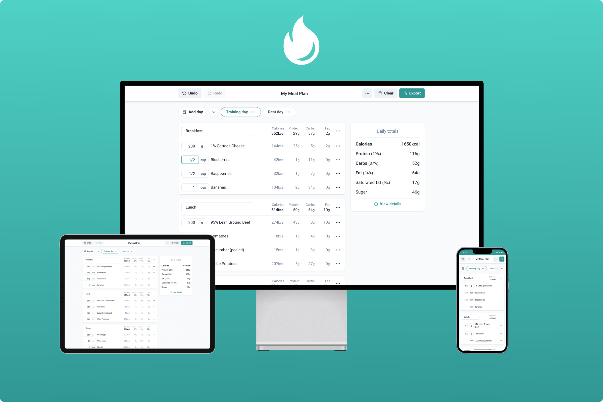

   

<h1 align="center">Nutrients Revealer</h1>

  <h3>A web-based meal plan editor for people who prepare all of their food.</h3>
  
 

## Notable libraries

- [Chakra UI](https://chakra-ui.com/)
- [React Beautiful Dnd](https://github.com/atlassian/react-beautiful-dnd)
- [React-pdf](https://react-pdf.org/)
- [Comlink-loader](https://github.com/GoogleChromeLabs/comlink-loader)
- [React window](https://github.com/bvaughn/react-window)
- [Fuse.js](https://fusejs.io/)
- [Framer Motion](https://www.framer.com/motion/)
- [Feather icons](https://feathericons.com/)

## Available Scripts

In the project directory, you can run:

### `yarn start`

Runs the app in the development mode.\
Open [http://localhost:3000](http://localhost:3000) to view it in the browser.

### `yarn build`

Builds the app for production to the `build` folder.\
It correctly bundles React in production mode and optimizes the build for the best performance.
